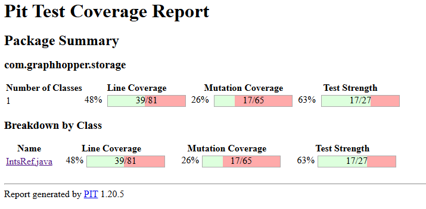
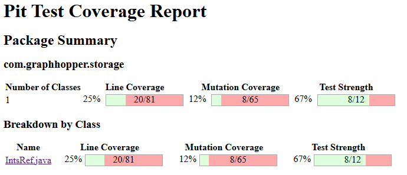
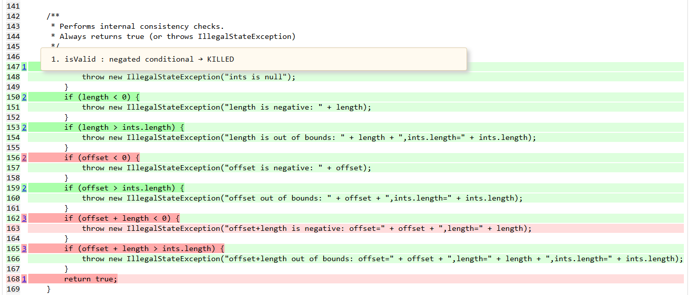
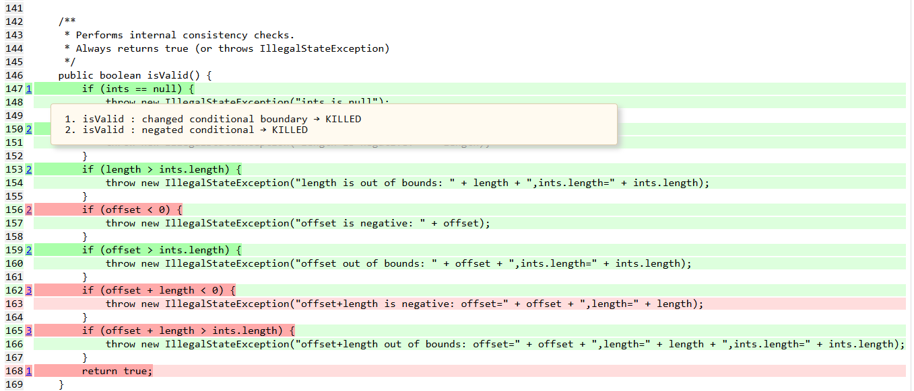
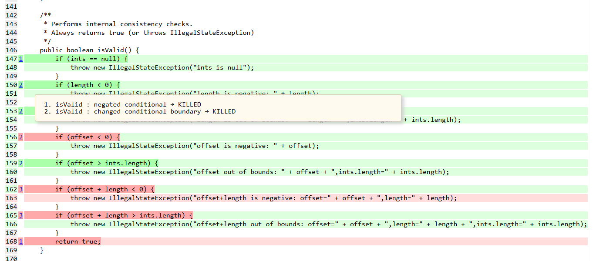
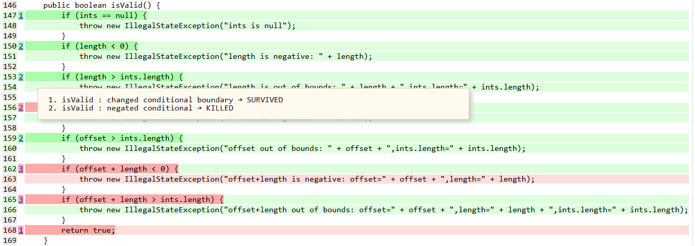
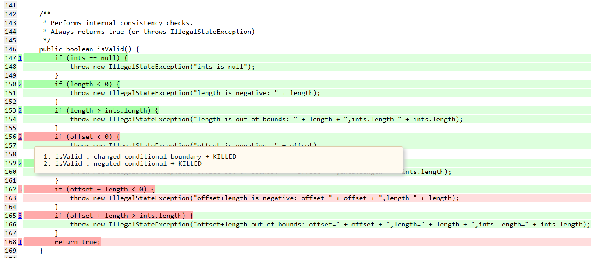

### Documentation des tests pour IntsRef.java dans storage.IntsRefTest.java

Score de mutation avec nouveaux tests pour classe IntsRef: 12%.

Score de mutation avec tests originaux pour classe IntsRef: 26%.

Ce mutant de négation du conditionnel a été détecté puisque "ints" est configuré à null dans le test.

Ces mutants de conditionnels ont été détectés puisque length a été configuré à -1, donc, sera vrai seulement pour conditionnel acceptant nombre négatif.

Ces mutants de conditionnels ont été détectés puisque length=5 est plus grand que ints.length=0, donc, sera vrai seulement pour conditionnel length plus grand que ints.length.

Ce mutant de négation du conditionnel a été détecté puisque "offset" est configuré entre -10 et -1 dans le test.

Ces mutants de conditionnels ont été détectés puisque "offset" est configuré entre 5 et 10 et ints.length = 0 dans le test.
