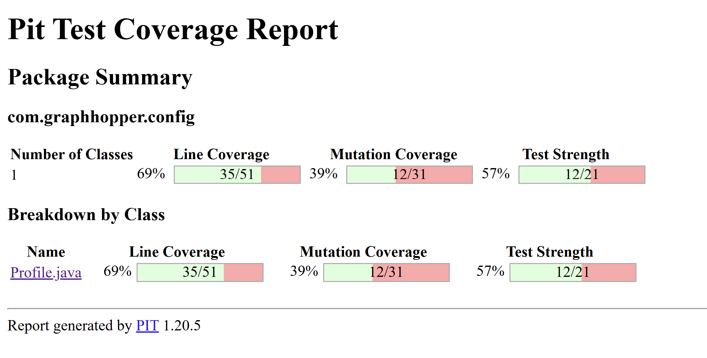
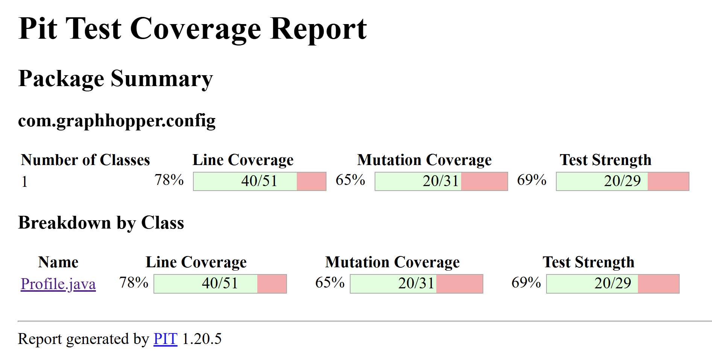
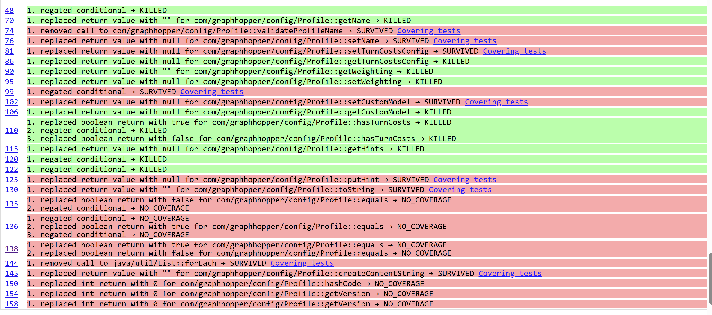
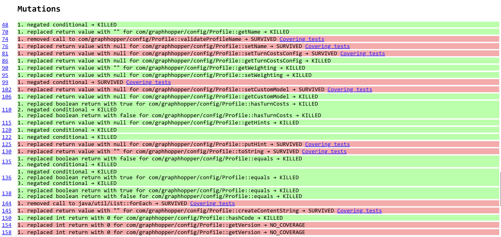

# Documentation des tests
## Profile.java (tests dans GraphHopperProfileTest.java)

#### 1. `testHashCodeEqualHash()`
* **Intention:**   
Vérifier que la méthode `hashCode()` retourne le même hachage pour le même objet Profile.  
* **Motivation des données:**   
On hash 2 fois le nom du profil sans modification entre les 2 appels pour vérifier si on obtient le même hachage.  
* **Explication oracle:**   
On compare les deux hash et vérifie qu'elles sont identiques.  

#### 2. `testHashCodeDifferentHash()`  
* **Intention:**   
Vérifier que la méthode `hashCode()` retourne des valeurs différentes pour des objets Profile différents.  
* **Motivation des données:**   
On teste avec 2 objets Profile avec des noms différents. Puisque la méthode `hashCode()` dépend du `name` et hash le nom. Donc, pour que les hashs soient différents on utilise des noms différents.   
* **Explication oracle:**   
On compare les 2 valeurs de hachage et vérifie qu'elles sont différentes. 

#### 3. `testEqualSameObject()`  
* **Intention:**   
Vérifier le cas du premier if dans la méthode `equals()` ce qui veut dire vérifier que ça retourne `true` quand on compare à lui-même.   
* **Motivation des données:**   
On utilise 1 objet Profile, qu'on compare à lui-même.  
* **Explication oracle:**   
La méthode doit retourner `true`, car l'objet doit toujours être équivalent à lui même.

#### 4. `testEqualNullObject()`  
* **Intention:**  
Vérifier le cas du 2ème if dans la méthode `equals()`, spécifiquement la première condition dans le OU logique. S'assurer que la méthode retourne `false` quand on compare un objet Profile à null.  
* **Motivation:**   
On utilise un objet Profile pour pouvoir appeler la méthode `equals()` et pour le comparer à null.   
* **Explication oracle:**   
La méthode retourne false car, un objet null n'est pas équivalent à un objet Profile. 

#### 5. `testEqualDifferentClass()`  
* **Intention:**   
Vérifier le cas du 2ème if dans la méthode `equals(Object o)`, spécifiquement la deuxième condition dans le OU logique. S'assurer que la méthode retourne `false` quand on compare un objet Profile à un autre objet qui n'est pas de la même classe.    
* **Motivation:**   
On utilise un objet Profile et un objet quelconque, on a choisi la classe String abitrairement, pour les comparer.   
* **Explication oracle:**  
La méthode retourne `false` car, un objet Profile n'est pas équivalents à un autre objet d'une classe différente.   

#### 6. `testEqualSameClassDifferentObject()`  
* **Intention:**   
Vérifier que pour deux objets Profile différents, la méthode `equals()` retourne `false` (le dernier cas après les if).
* **Motivation des données:**   
On a utilisé 2 objets Profile avec des noms différents. Puisque la méthode vérifie seulement si les noms sont les mêmes.  
* **Explication oracle:**   
La méthode retourne `false` car, les noms des profils sont différents alors ils ne sont pas équivalents. 

#### 7. `testEqualSameNameDifferentObject()`  
* **Intention:**  
Vérifier que la méthode retourne `true` pour deux objets Profile différents mais avec le même nom.
* **Motivation des données:**   
On a utilisé 2 objets Profile différent mais avec les mêmes noms. Puisque la méthode vérifie seulement si les noms sont les mêmes.  
* **Explication oracle:**   
La méthode retourne `true` car, les noms des profils sont les mêmes alors ils seronts équivalents. 

### Mutations
#### `Profile.java`

|                 | Avant |Après|
|-----------------|---------- |-----|
|Score de mutation|| |
|Détection mutants| | | 

Après l'ajout des nouveaux tests, les tests on a pu détecté 8 mutants. 

--- 
#### Nouveaux mutants découverts: 
#### Dans `equals()`  
```
if (this == o) return true;
```
1.  replaced boolean return with false   
Dans le `testEqualSameObject()`, le profile est comparé à soi-même ce qui devrait retourner `true`, mais la fonction `equals()` retourne `false`, ce qui fait échoué le test. Le mutant est tué.   

2. negated conditional
La condition `this == o` change à `this != o return true`. Ainsi, lorsque l'objet Profile n'est pas égale à `o` ça va retourner `false` au lieu d'un `true`.  
Par exemple, dans `testEqualNullObjetc()`, la méthode retourne `true` quand on attend `false`. 
  
```
if (o == null || getClass() != o.getClass()) return false;
```
3. negated conditional  
`(o != null || getClass() != o.getClass()) return false`
Dans le test `testEqualNullObject()` le `null` passera directement à la comparaison des noms des objets. Puisque le null n'a pas de `name`, il va envoyer une exception ce qui fait que le test échoue.   
[source](https://stackoverflow.com/questions/68808710/how-to-know-if-test-was-killed-by-junit-assertion-error-in-pit-mutation-testing)

4. replaced boolean return with true  
Selon le test `testEqualNullObject()` et `testEqualDifferentClass`,  si `o == null` ou `getClass() != o.getClass()` est vrai. La méthode va retourner `true`. Les tests échoués, car ils attendent un `false`.  

5. negated conditional  
`(o == null || getClass() == o.getClass()) return false`  
Selon le test `testEqualSameNameDifferentObject()`, `profile` et `profile2` sont de la même classe. Alors, `getClass() == o` est vrai et la méthode `equals()` va retourner `false` au lieu de `true`. Donc, le test va échoué.   

```
return name.equals(profile.name);
```
6. replaced boolean return with true  
Pour les tests qui attendent `false`, les tests vont échoués, car la méthode retourne toujours `true`.    

7. replaced boolean return with false  
Pour les tests qui attendent `true`, les tests vont échoués, car la méthode retourne toujours `false`.      

#### Dans `hashCode()`
```
return name.hashCode();
```
8. replaced int return with 0  
Pour le test `testHashCodeDifferentHash`, on s'attend à obtenir des hash différents, mais ils ont tous une valeur de 0, à cause de la mutation, ce qui fait que le test échoue.   


